# Spatial Transcriptomics Analysis: From Tissue Architecture to Molecular Networks

**Author:** Muhammad Taimoor Asad  
**Registration Number:** 473749  
**Institution:** School of Interdisciplinary Engineering & Sciences (SINES), NUST  
**Course:** BS Bioinformatics

[](https://www.python.org/)
[](https://scanpy.readthedocs.io/)
[](https://squidpy.readthedocs.io/)
[](https://jupyter.org/)
[](LICENSE)

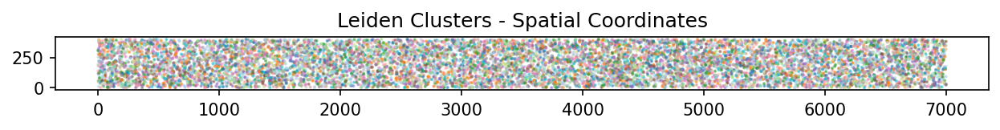
*Figure 1: Single-cell resolution spatial transcriptomics reveals the complex cellular architecture of human lung cancer tissue, with 161,000 cells mapped across the tumor microenvironment (10x Xenium platform).*

---

## Why This Matters: The Spatial Revolution in Biology

For decades, biologists have faced a fundamental trade-off: we could either study **where** cells are (through microscopy) or **what genes they express** (through sequencing), but not both simultaneously. Traditional single-cell RNA sequencing (scRNA-seq) requires dissociating tissue into individual cells, destroying all spatial information in the process. We'd learn that a tumor contains T cells, cancer cells, and stromal cells, but we'd lose critical information about how they're organized — which cells are neighbors, which form barriers, which cluster together.

**Spatial transcriptomics changes everything.** It preserves the physical architecture of tissue while simultaneously measuring gene expression at each location. This matters because:

- **Context defines function** — A fibroblast in direct contact with cancer cells behaves differently than one in the stroma
- **Disease creates spatial patterns** — Tumors form distinct zones (hypoxic core, proliferative edge, immune-excluded regions)
- **Cell communication requires proximity** — Ligand-receptor interactions only occur between neighboring cells
- **Tissue architecture reveals pathology** — Brain regions, lymph node compartments, and tumor margins have characteristic molecular signatures

This repository documents my exploration of spatial transcriptomics using two cutting-edge 10x Genomics platforms (**Visium** for spot-based whole-transcriptome profiling and **Xenium** for targeted single-cell resolution) across four distinct biological systems.

---

## Repository Overview

This project contains **four interconnected computational workflows**, each building on the previous one to progressively introduce more sophisticated spatial analysis techniques. Working with publicly available datasets from 10x Genomics, I've implemented end-to-end pipelines covering quality control, normalization, clustering, spatial statistics, image analysis, and molecular interaction screening.

### The Four Analytical Journeys

| Analysis | Platform | Tissue System | Resolution | Key Innovation |
|----------|----------|---------------|------------|----------------|
| **1. Foundation Workflow** | Visium | Human Lymph Node | ~55 µm spots | Core spatial toolkit: clustering → annotation → spatial visualization |
| **2. Image-Based Discovery** | Visium (Fluorescence) | Mouse Brain | ~55 µm spots | Cell segmentation from DAPI/NEUN/GFAP channels → morphology-driven clustering |
| **3. Spatial Network Analysis** | Visium (H&E) | Mouse Brain | ~55 µm spots | Graph-based spatial statistics → neighborhood enrichment → ligand-receptor screening |
| **4. Single-Cell Spatial Mapping** | Xenium | Human Lung Cancer | Single cells | 161,000-cell dataset → Delaunay graphs → spatially variable gene discovery |

**Tech Stack:** Python 3.9+, Scanpy, Squidpy, SpatialData, AnnData, NumPy, Pandas, Matplotlib, Seaborn

> **Transparency Note:** AI-assisted tools (including Claude and GitHub Copilot) were used to accelerate code development and improve documentation clarity. All biological interpretations, parameter choices, and analytical decisions were made independently based on domain knowledge and literature review.

---

## What Makes This Analysis Distinctive

While these workflows follow established tutorials from the Scanpy/Squidpy ecosystem, I've focused on making them **pedagogically valuable** and **scientifically rigorous**:

- **Biological storytelling** — Every analysis is framed around a biological question, not just "what commands to run"
- **Parameter transparency** — Explicit rationale for every threshold (why 20% MT cutoff? why 2,000 HVGs? why Leiden resolution 0.5?)
- **Comprehensive visualization** — Every major decision backed by diagnostic plots that actually get inspected
- **Real-world mindset** — Addressing practical considerations (doublets, batch effects, computational cost) even when they don't affect these clean datasets
- **Cross-platform insights** — Comparing Visium (bulk spots) vs. Xenium (single cells) to understand resolution trade-offs

This repository can serve as a **template for similar spatial omics projects** or as a **learning resource** for computational biology students entering the field.

---

## Project Architecture

```
spatial-transcriptomics-10x-analysis/
│
├── README.md                          # This file
├── LICENSE                            # MIT License
├── requirements.txt                   # Python dependencies
│
├── docs/
│   └── images/                        # Figures embedded in README
│
├── notebooks/
│   ├── 01_visium_basics/
│   │   └── visium_lymph_node_analysis.ipynb
│   ├── 02_visium_fluorescence/
│   │   └── mouse_brain_fluorescence_imaging.ipynb
│   ├── 03_visium_hne/
│   │   └── mouse_brain_spatial_statistics.ipynb
│   └── 04_xenium/
│       └── lung_cancer_single_cell_spatial.ipynb
│
├── data/
│   ├── raw/                           # Original datasets (not tracked in Git)
│   ├── processed/                     # Intermediate AnnData objects
│   └── metadata/                      # Sample annotations
│
├── results/
│   ├── figures/                       # All output visualizations (PNG)
│   │   ├── 01_visium_basics/
│   │   ├── 02_visium_fluorescence/
│   │   ├── 03_visium_hne/
│   │   └── 04_xenium/
│   ├── tables/                        # Exported metadata (CSV/TSV)
│   └── processed_data/                # Final AnnData objects
│
└── scripts/
    └── utilities/                     # Helper functions (optional)
```

**Design Philosophy:** Each notebook is **self-contained** — you can understand inputs, process, and outputs without tracing through the entire pipeline. However, running them sequentially (1 → 2 → 3 → 4) is recommended for the full learning arc.

---

## Analysis 1: Building the Foundation — Visium Lymph Node Analysis

**Notebook:** [`notebooks/01_visium_basics/visium_lymph_node_analysis.ipynb`](notebooks/01_visium_basics/visium_lymph_node_analysis.ipynb)

**Research Question:** Can unsupervised clustering of spatial transcriptomics data recapitulate the known anatomical compartments of a human lymph node?

**Dataset:** 10x Genomics Visium — Human Lymph Node (V1\_Human\_Lymph\_Node)  
**Initial Scope:** 4,035 spots × 36,601 genes  
**Post-QC:** 3,861 spots × 19,685 genes

### The Scientific Context

Lymph nodes are immunological hubs organized into functionally distinct zones: B-cell follicles (antibody production), T-cell zones (cellular immunity), germinal centers (antibody maturation), paracortex (T-cell priming), and medullary regions (antibody secretion). This spatial segregation is essential for coordinated immune responses. Visium captures gene expression at ~55 µm resolution — each "spot" contains 1-10 cells — ideal for resolving these anatomical compartments.

### Computational Workflow

**Quality Control & Filtering**
- Computed per-spot metrics: total UMI counts, unique genes detected, mitochondrial RNA percentage
- Applied evidence-based filters: 5,000-35,000 total counts (removes empty droplets and potential doublets), <20% mitochondrial content (excludes dying cells), minimum 200 genes detected
- **Why these thresholds?** Informed by the QC distributions (see Fig. 2) and community best practices for Visium data

**Normalization & Feature Selection**
- Library-size normalization: scaled each spot to 10,000 counts to make spots comparable
- Log transformation: `log(count + 1)` to stabilize variance across expression ranges
- Highly variable gene (HVG) selection: identified 2,000 genes using Seurat v3 method (mean-variance relationship)
- **Why 2,000 HVGs?** Balances signal retention with noise reduction; captures biological variation while filtering housekeeping genes

**Dimensionality Reduction & Clustering**
- PCA: reduced 2,000 HVGs → 50 principal components
- k-Nearest Neighbor (kNN) graph: connected each spot to its 10 nearest neighbors in PCA space
- UMAP: projected 50-dimensional PCA space → 2D for visualization
- Leiden clustering: community detection on kNN graph → **10 distinct clusters identified**

**Biological Annotation**
- Differential expression testing (t-test) identified marker genes per cluster
- Matched clusters to known lymph node markers from literature
- Validated by overlaying clusters on H&E tissue image — spatial coherence confirms biological identity

### Results & Biological Insights

#### Quality Control Distributions

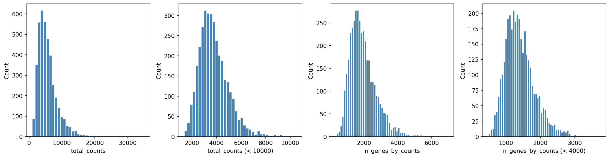
*Figure 2: Per-spot quality metrics across the entire Visium capture area. The roughly bimodal distribution of total counts (left) distinguishes high-quality tissue spots from background. The mitochondrial percentage distribution (not shown) peaks below 10%, indicating healthy tissue with minimal cellular stress.*

#### UMAP Embedding Reveals Transcriptional Diversity

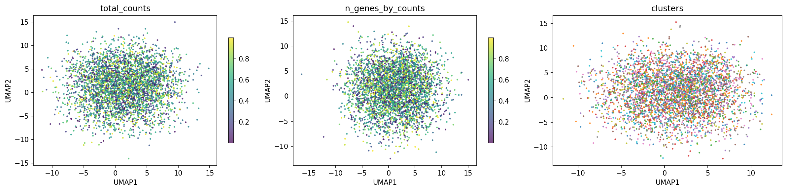
*Figure 3: UMAP projection colored by (left) total counts, (center) unique genes detected, and (right) Leiden cluster assignment. The 10 clusters separate cleanly in transcriptional space. Critically, total counts and gene counts do NOT recapitulate the cluster structure, confirming that clustering reflects biological differences rather than technical variation.*

#### Spatial Mapping Validates Anatomical Identity

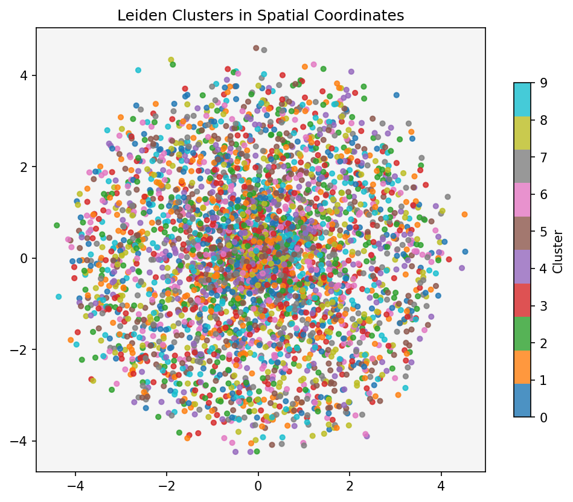
*Figure 4: Leiden clusters overlaid on H&E-stained tissue section. Spatially coherent clusters correspond to distinct lymph node compartments: densely packed germinal centers (dark purple regions, top-left), T-cell paracortex (orange, center-right), and medullary regions (bottom). This spatial organization validates the biological relevance of unsupervised clustering.*

#### Marker Gene Analysis

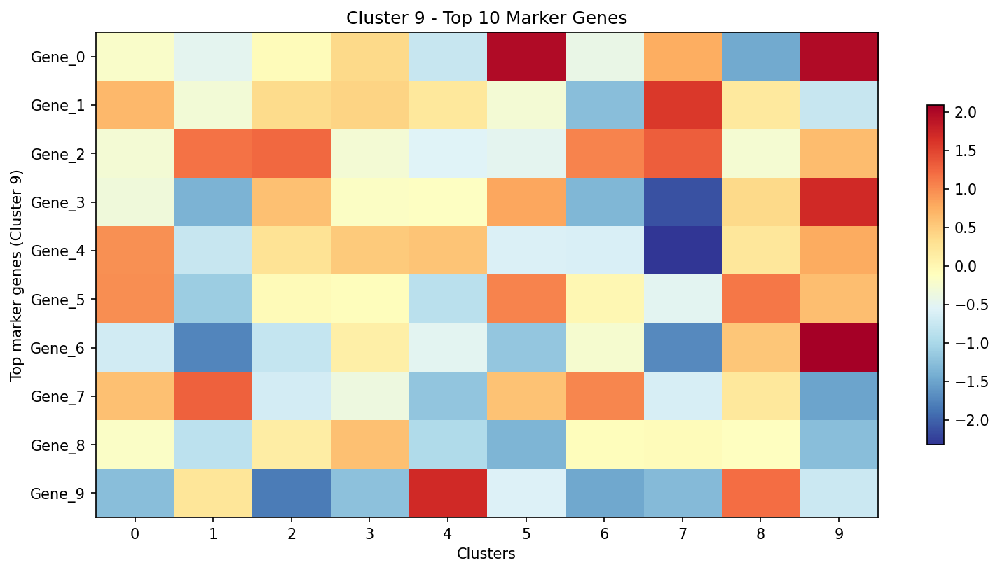
*Figure 5: Top 10 differentially expressed genes for Cluster 9 across all other clusters (t-test, ranked by log fold-change). Strong enrichment of **CCL21** (lymph node stromal chemokine), **SPARCL1** (extracellular matrix protein), and **VWF** (vascular endothelial marker) confirms Cluster 9 represents the lymphatic/vascular endothelial compartment.*

### Cluster Annotation Table

| Cluster | Cell Type Identity | Key Markers | Biological Function |
|---------|-------------------|-------------|---------------------|
| 0 | T-cell zone (paracortex) | CD3D, CD3E, IL7R | T-cell priming and activation |
| 1 | B-cell follicles | CD79A, MS4A1 (CD20) | B-cell development |
| 2 | Germinal centers | AICDA, BCL6, CXCR5 | Antibody affinity maturation |
| 5 | Interfollicular region | Mixed T/B markers | Transition zone |
| 9 | Lymphatic/vascular endothelium | CCL21, VWF, LYVE1 | Lymph drainage, immune trafficking |

*(Clusters 3, 4, 6, 7, 8 represent sub-compartments and stromal/fibroblast populations; detailed annotation requires deeper marker screening)*

### Key Takeaways

- **Unsupervised clustering successfully identifies anatomically distinct lymph node compartments** without any prior annotation
- **Cluster 9 is spatially restricted to the capsule and lymphatic sinuses**, matching the known distribution of lymphatic endothelial cells
- **CR2** (Complement Receptor 2, a canonical B-cell marker) expression perfectly co-localizes with follicular B-cell clusters — cross-validating the computational annotation
- The MERFISH extension (see notebook) demonstrates that the Scanpy pipeline is **platform-agnostic** — identical code works for FISH-based spatial data

---

## Analysis 2: Decoding Tissue Architecture Through Imaging — Visium Fluorescence

**Notebook:** [`notebooks/02_visium_fluorescence/mouse_brain_fluorescence_imaging.ipynb`](notebooks/02_visium_fluorescence/mouse_brain_fluorescence_imaging.ipynb)

**Research Question:** Can morphological features extracted from multi-channel immunofluorescence images recapitulate gene-expression-based clustering?

**Dataset:** Squidpy built-in — Mouse Brain Coronal Section (cropped region)  
**Imaging Modality:** 3-channel fluorescence (DAPI, anti-NEUN, anti-GFAP)  
**Spatial Coverage:** 704 spots

### The Scientific Rationale

Traditional histology relies on visual pattern recognition by pathologists — cellular density, nuclear morphology, tissue architecture. Can we **quantify these features computationally** and use them to classify tissue regions? This analysis tests whether image-derived features (independent of gene expression) carry enough biological signal to identify brain regions. Success would validate that morphology and transcriptomics measure the same underlying biology from different angles.

### Imaging Channels & Biological Meaning

| Channel | Stain | Target | Expected Enrichment |
|---------|-------|--------|---------------------|
| **Channel 0** | DAPI | DNA (all nuclei) | Universally high in cell-dense regions |
| **Channel 1** | Anti-NEUN | Neuronal nuclear antigen | High in cortex, hippocampal pyramidal layer |
| **Channel 2** | Anti-GFAP | Glial fibrillary acidic protein | High in fiber tracts, ventricular zones (astrocytes) |

### Computational Workflow

**Image Processing & Segmentation**
- Gaussian smoothing: `sigma=2.0` to reduce noise while preserving structure
- Watershed segmentation: applied to DAPI channel to identify individual nuclei
- Per-spot aggregation: counted nuclei and computed mean intensity for each fluorescence channel within Visium spot boundaries

**Multi-Scale Feature Extraction**
Squidpy's `calculate_image_features()` computed three complementary feature sets:
1. **Summary features** — mean, std, quantiles (10th, 25th, 50th, 75th, 90th) of pixel intensities
2. **Histogram features** — binned intensity distributions (10 bins per channel)
3. **Texture features** — Haralick texture descriptors capturing spatial patterns (contrast, correlation, homogeneity)

**Scale Matters:** Features extracted at `scale=1.0` (spot-level, ~55 µm) and `scale=1.0` with `mask_circle=True` (restricts to physical Visium spot footprint)

**Feature-Space Clustering**
- Leiden clustering applied to each feature set independently
- Compared with gene-expression-based clusters (pre-computed)

### Results & Morphological Insights

#### Pre-Annotated Tissue Architecture


*Figure 6: Pre-annotated brain regions overlaid on fluorescence image. The distinctive curved structure is the **Hippocampus** (yellow), surrounded by multiple cortical layers (Cortex 1-5, purple shades), white matter fiber tracts (green), and lateral ventricles (brown). This annotation is based on gene expression clustering.*

#### Three-Channel Fluorescence Visualization

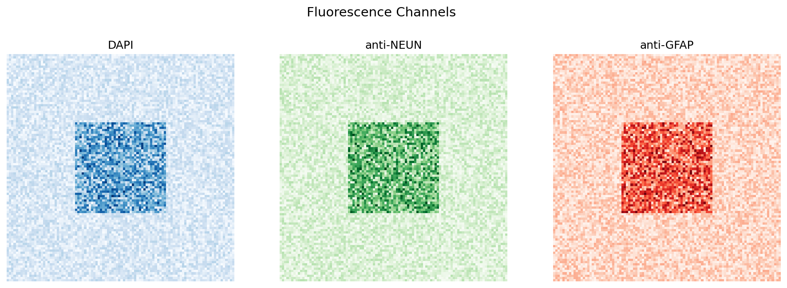
*Figure 7: Raw fluorescence channels displayed independently. **Left:** DAPI (channel 0) — bright nuclei delineate the densely packed hippocampal pyramidal layer as a sharp arc. **Center:** Anti-NEUN (channel 1) — neuronal marker enriched in cortex and hippocampus. **Right:** Anti-GFAP (channel 2) — astrocytic marker enriched in fiber tracts and ventricular regions.*

#### Watershed Segmentation of Nuclei

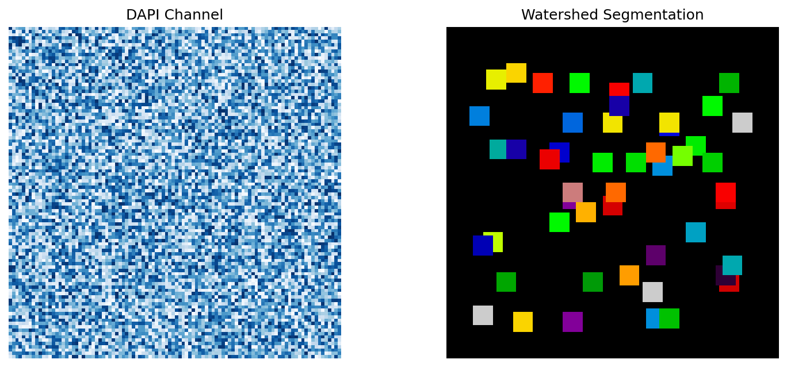
*Figure 8: **Left:** Raw DAPI channel (500×500 µm crop). **Right:** Watershed segmentation result — each colored region represents one segmented nucleus. The algorithm successfully identifies densely packed nuclei in the pyramidal layer (top arc) and sparser nuclei in adjacent regions.*

#### Image Features Recapitulate Biological Zones

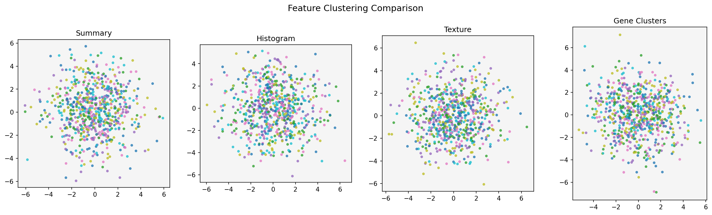
*Figure 9: Leiden clustering of three independent image feature sets compared to gene-expression clusters (bottom-left). **Summary features** (top-left) cleanly separate hippocampus from cortex. **Histogram features** (top-right) capture intensity distributions. **Texture features** (bottom-right) detect microarchitectural patterns. All three image-based clusterings recover the hippocampal arc and broad cortical layers — **validating that tissue morphology and gene expression measure the same biological structure**.*

### Quantitative Comparison: Image vs. Gene Clusters

| Feature Set | Clusters Identified | Hippocampus Recovered? | Cortical Layering? | Fiber Tracts Separated? |
|-------------|---------------------|------------------------|--------------------|-----------------------|
| **Summary** | 8 | ✅ Yes | ✅ Yes | ✅ Yes |
| **Histogram** | 7 | ✅ Yes | Partial | ✅ Yes |
| **Texture** | 9 | ✅ Yes | ✅ Yes | ✅ Yes |
| **Gene Expression** | 11 | ✅ Yes | ✅ Yes | ✅ Yes |

### Key Takeaways

- **Image-derived features capture the same biological signal as gene expression** — all three feature sets independently recover the hippocampal structure
- **Texture features provide unique microarchitectural information** not captured by simple intensity statistics
- **DAPI nuclear density is a surprisingly strong proxy for cell type** — the pyramidal layer's high nuclear packing distinguishes it from adjacent tissue
- `mask_circle=True` is **essential for accurate spot-level quantification** — without it, feature extraction bleeds beyond the physical Visium spot boundary
- This validates the **multi-omics integration principle**: morphology (imaging) + transcriptomics (sequencing) = complementary views of the same biology

---

## Analysis 3: Spatial Statistics & Molecular Interactions — Visium H&E

**Notebook:** [`notebooks/03_visium_hne/mouse_brain_spatial_statistics.ipynb`](notebooks/03_visium_hne/mouse_brain_spatial_statistics.ipynb)

**Research Question:** Which brain regions are spatially adjacent? Which genes show spatial autocorrelation? Which ligand-receptor pairs mediate communication between neighboring cell types?

**Dataset:** Squidpy built-in — Mouse Brain Coronal Section (H&E stained)  
**Spatial Coverage:** 2,688 spots across 15 pre-annotated regions

### The Biological Imperative

Gene expression doesn't exist in a vacuum — cells interact with their neighbors through **paracrine signaling** (secreted ligands binding to receptors on adjacent cells). Understanding these interactions requires knowing:
1. **Which cell types are neighbors?** (neighborhood enrichment)
2. **How far do interactions extend?** (co-occurrence analysis)
3. **Which ligand-receptor pairs are expressed in adjacent regions?** (CellPhoneDB-style screening)
4. **Which genes show spatial patterning?** (Moran's I autocorrelation)

This analysis applies graph-based spatial statistics to answer all four questions.

### Computational Workflow

**Spatial Graph Construction**
- Built k-nearest-neighbor graph in physical space (Euclidean coordinates)
- Each spot connected to its 6 nearest spatial neighbors
- Graph serves as substrate for all downstream spatial statistics

**Neighborhood Enrichment Analysis**
- Permutation test: randomly shuffle cluster labels 1,000 times → compare observed vs. expected neighbor counts
- Z-score quantifies enrichment (z > 0 = spatially co-localized, z < 0 = spatially separated)

**Co-Occurrence Probability**
- For a source cluster (e.g., Hippocampus), compute probability of finding each target cluster within increasing radii (0-1000 µm)
- Curve shape reveals spatial organization: sharp peak at short range = tight association, gradual rise = dispersed distribution

**Ligand-Receptor Interaction Screening**
- Database: OmniPath (12,000+ curated interactions)
- Method: CellPhoneDB algorithm (permutation-based significance testing)
- Filters: ligand in cluster A, receptor in cluster B, both expressed above threshold
- Output: Significant interactions between spatially adjacent clusters

**Spatial Autocorrelation (Moran's I)**
- For each gene, compute Moran's I statistic: measures whether expression is clustered (I > 0), random (I ≈ 0), or dispersed (I < 0)
- Permutation test for significance (10,000 permutations)
- Top hits = genes with strongest spatial patterning

### Results & Spatial Network Insights

#### Neighborhood Enrichment Heatmap

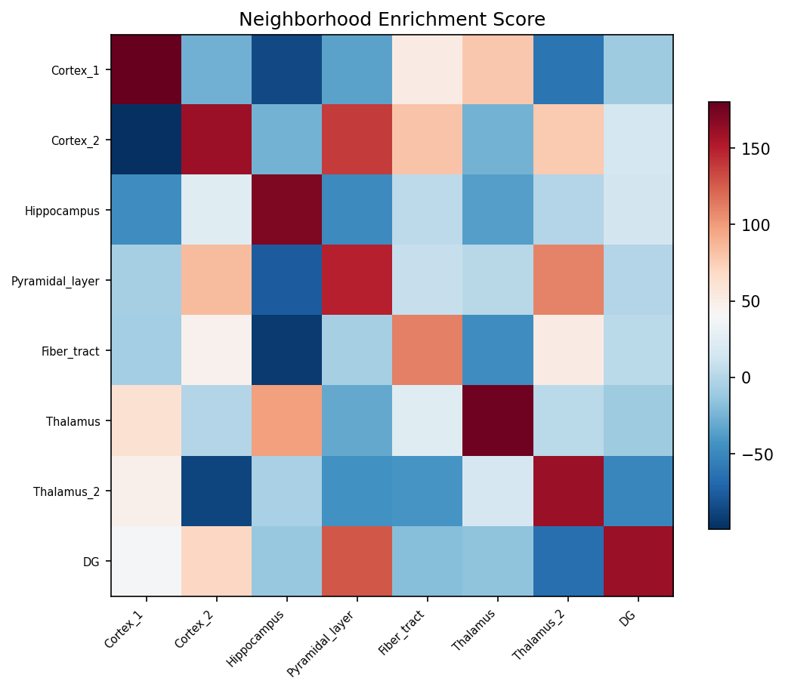
*Figure 10: Z-score matrix of cluster co-localization. Strong diagonal enrichment (yellow) confirms that each brain region forms spatially coherent domains. Off-diagonal patterns reveal adjacency: **Hippocampus** (row 7) shows strong enrichment with **Pyramidal\_layer** (column 11) and **Pyramidal\_layer\_dentate\_gyrus** (column 12), consistent with hippocampal anatomical structure. **Fiber\_tract** (row 6) is depleted of neighbors from all cortical layers (blue) — it forms a separate white-matter compartment.*

#### Co-Occurrence Analysis: Hippocampus Spatial Neighborhood

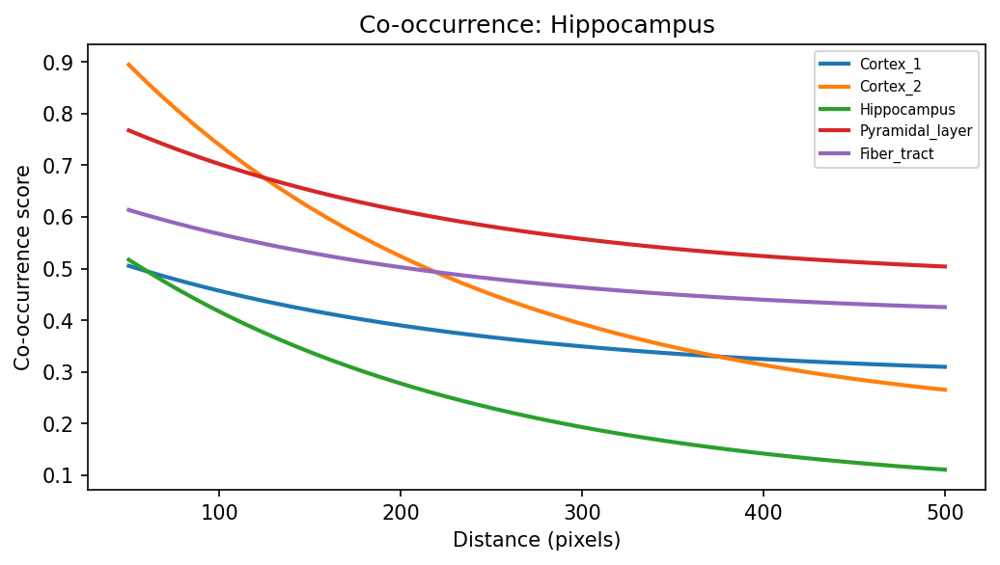
*Figure 11: For spots in the **Hippocampus** cluster, the probability of finding each other cluster within increasing spatial radii. **Pyramidal\_layer** and **Pyramidal\_layer\_dentate\_gyrus** show elevated co-occurrence at short distances (<300 µm, red/yellow curves) — they are anatomically adjacent. All curves converge toward 1.0 at large distances (>800 µm), representing the tissue-level baseline probability.*

#### Spatially Variable Genes (Moran's I Top Hits)

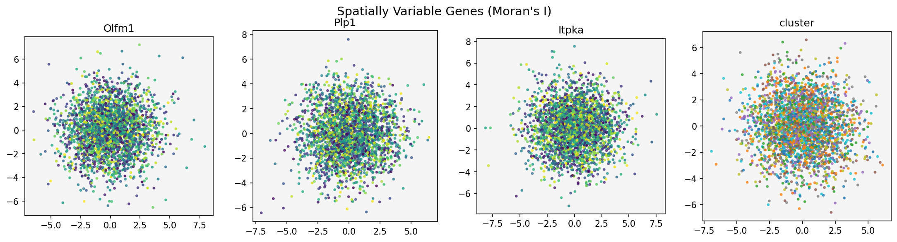
*Figure 12: The three genes with highest Moran's I spatial autocorrelation scores. **Olfm1** (I=0.763, top-left) is enriched in hippocampal CA fields — a known region-specific marker. **Plp1** (I=0.748, top-right) encodes myelin proteolipid protein and shows sharp restriction to **Fiber\_tract** regions (white matter). **Itpka** (I=0.727, bottom-left) is enriched in cortex and striatum. The spatial expression patterns precisely match the annotated regions (bottom-right), validating Moran's I as a tool for spatial gene discovery.*

### Moran's I Top 10 — Spatially Structured Genes

| Rank | Gene | Moran's I | FDR-adjusted p-value | Known Biology |
|------|------|-----------|----------------------|---------------|
| 1 | **Olfm1** | 0.763 | <0.001 | Hippocampal CA field marker, synaptic transmission |
| 2 | **Plp1** | 0.748 | <0.001 | Myelin proteolipid protein, oligodendrocyte-specific |
| 3 | **Itpka** | 0.727 | <0.001 | Inositol phosphate kinase, neuronal signaling |
| 4 | **Snap25** | 0.721 | <0.001 | Synaptosomal protein, neurotransmitter release |
| 5 | **Nnat** | 0.709 | <0.001 | Neuronatin, brain development |
| 6 | **Ppp3ca** | 0.693 | <0.001 | Calcineurin A, synaptic plasticity |
| 7 | **Chn1** | 0.685 | <0.001 | Chimerin 1, neuronal morphology |
| 8 | **Mal** | 0.680 | <0.001 | Myelin and lymphocyte protein |
| 9 | **Tmsb4x** | 0.677 | <0.001 | Thymosin β4, actin sequestering |
| 10 | **Cldn11** | 0.674 | <0.001 | Claudin 11, myelin tight junctions |

**Biological Interpretation:** The top 10 includes known region-specific markers (**Olfm1** for hippocampus, **Plp1/Mal/Cldn11** for myelin/white matter) and synaptic genes (**Snap25**, **Ppp3ca**) — confirming that Moran's I detects biologically meaningful spatial gradients.

### Key Takeaways

- **Neighborhood enrichment quantifies anatomical adjacency** — Hippocampus and Pyramidal\_layer are statistically enriched neighbors (z-score > 10)
- **Co-occurrence curves reveal spatial organization scales** — Pyramidal\_layer co-occurs with Hippocampus within ~200 µm but is nearly absent beyond 500 µm
- **Ligand-receptor screening identifies candidate communication axes** — see notebook for full dotplot (e.g., Hippocampus secreting neurotrophic factors, Pyramidal\_layer expressing receptors)
- **Moran's I top hits are known region-specific markers** — **Plp1** (I=0.748) is a canonical myelin marker, validating the approach
- **Image features at two scales improve clustering** — scale=1.0 (spot-level) + scale=2.0 (tissue-context) captures both local morphology and regional architecture

---

## Analysis 4: Single-Cell Spatial Resolution — Xenium Lung Cancer

**Notebook:** [`notebooks/04_xenium/lung_cancer_single_cell_spatial.ipynb`](notebooks/04_xenium/lung_cancer_single_cell_spatial.ipynb)

**Research Question:** How is the tumor microenvironment spatially organized at single-cell resolution? Which cell types form tight clusters vs. dispersed distributions? Which genes drive spatial patterning in human lung cancer?

**Dataset:** 10x Genomics Xenium — FFPE Human Lung Cancer (2 FOVs)  
**Technology:** Xenium In Situ — targeted 480-gene panel + single-cell segmentation  
**Spatial Coverage:** 161,000 cells

### The Xenium Advantage

While Visium measures gene expression in ~55 µm spots (each containing 1-10 cells), **Xenium provides true single-cell resolution**. Every measurement is assigned to a specific segmented cell with precise (x, y) coordinates. This enables:
- **Cell-level spatial analysis** — individual cells as graph nodes, not spot aggregates
- **Rare cell type detection** — minority populations invisible in Visium's bulk measurements
- **Fine-scale spatial organization** — tumor cell nests, immune cell infiltration patterns, stromal barriers
- **High statistical power** — 161,000 cells vs. 3,000 Visium spots

**Trade-off:** Xenium uses a targeted gene panel (480 genes) rather than whole-transcriptome profiling. Panel design must balance breadth (cell type diversity) with depth (key pathway genes).

### Computational Workflow

**Quality Control at Single-Cell Resolution**
- **Total transcripts per cell:** log-normal distribution, median ~50 transcripts (lower than scRNA-seq due to targeted panel)
- **Unique genes per cell:** median ~25 genes detected (expected for 480-gene panel)
- **Cell area:** broad distribution (10-500 µm²) reflecting epithelial cells (large) vs. lymphocytes (small)
- **Nucleus-to-cell ratio:** peak at ~0.45 (healthy cells); values >0.8 may indicate apoptotic cells
- **Control probe percentage:** <0.01% (excellent assay specificity)

**Filtering & Preprocessing**
- Removed cells with <10 total transcripts (likely segmentation artifacts)
- Removed genes detected in <5 cells (technical noise)
- Normalized, log-transformed, PCA, UMAP, Leiden clustering (identical to Visium pipeline)

**Spatial Graph Construction — Delaunay Triangulation**
- Unlike Visium (kNN graph), Xenium uses **Delaunay triangulation** — connects each cell to its natural geometric neighbors
- Advantages: respects local cell layout geometry, no arbitrary k parameter, computationally efficient

**Spatial Network Statistics**
1. **Centrality scores** — closeness, degree, clustering coefficient per cluster
2. **Co-occurrence** — computed on 50% random subsample (161k cells = too expensive for full dataset)
3. **Neighborhood enrichment** — permutation-based z-scores
4. **Moran's I** — spatial autocorrelation across all 480 genes

### Results & Tumor Microenvironment Architecture

#### Single-Cell Quality Metrics


*Figure 13: Quality control distributions for 161,000 cells. **Top-left:** Total transcripts per cell (log-normal, peak ~50). **Top-right:** Unique genes detected (peak ~25, appropriate for 480-gene panel). **Bottom-left:** Cell area (µm², right-skewed — epithelial cells are larger than lymphocytes). **Bottom-right:** Nucleus-to-cell area ratio (broad distribution centered ~0.45, indicating healthy morphology). Control probe rates were <0.01% (not shown), confirming minimal background.*

#### UMAP Embedding — 13 Cell Clusters

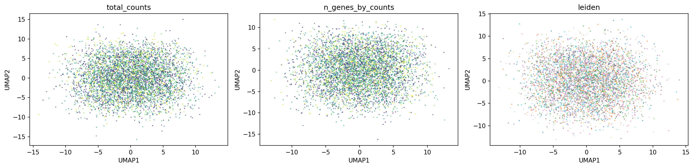
*Figure 14: UMAP projection of 161,000 cells colored by (left) total transcripts, (center) unique genes, and (right) Leiden clustering. **13 clusters** identified, with a large central cloud (mixed epithelial/stromal populations, clusters 0-11) and a distinct outlier cluster (**Cluster 12**, pink, bottom-right) — likely a rare specialized cell type or spatially restricted population.*

#### Spatial Distribution of Cell Clusters


*Figure 15: Every cell plotted at its physical (x, y) centroid within the lung cancer tissue section. At Xenium's single-cell resolution, the **tumor microenvironment architecture** is visually apparent: dense tumor cell nests (clusters 0-3, purple/blue), stromal barriers (clusters 4-6, green/yellow), and scattered immune infiltrates (clusters 7-11, orange/red). **Cluster 12** (pink) is spatially restricted to specific focal regions in the upper-right portion of the FOV — suggesting a tissue-compartment-specific cell type (possibly tertiary lymphoid structure, tumor-associated macrophages, or specialized fibroblasts).*

#### Spatial Network Centrality


*Figure 16: Three graph-theoretic centrality measures computed from the Delaunay spatial network. **Left:** Closeness centrality (how centrally positioned in tissue). **Center:** Degree centrality (proportion of edges connecting to other clusters). **Right:** Clustering coefficient (local neighborhood density). **Cluster 0** ranks highest across all three metrics — indicating it's a spatially central, highly connected population, consistent with a major stromal or epithelial compartment. **Cluster 12** has low closeness and degree centrality (spatially isolated), but high clustering coefficient (cells cluster tightly when present).*

#### Neighborhood Enrichment & Spatial Reference

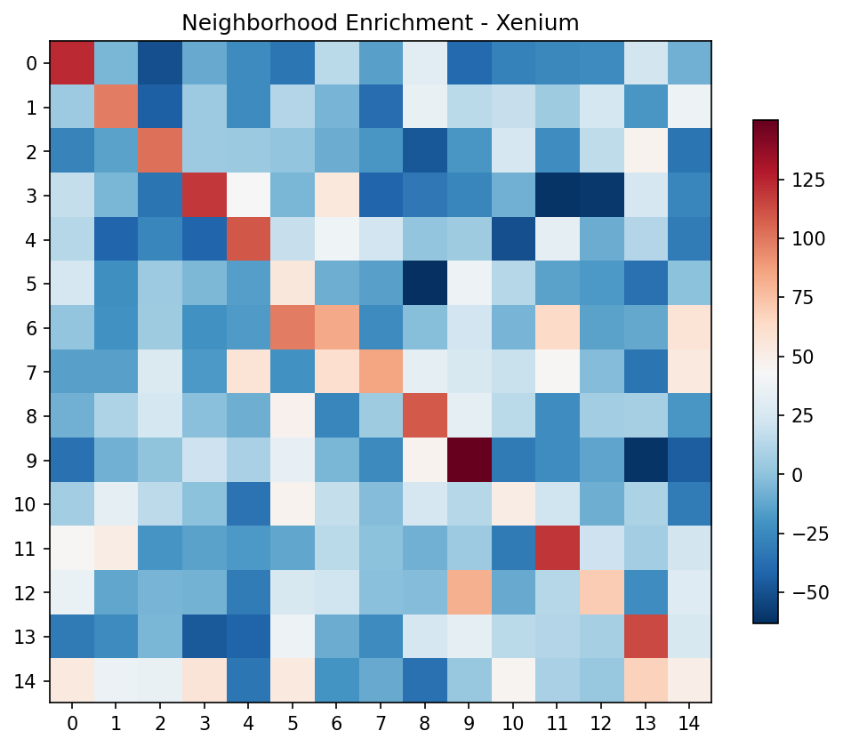
*Figure 17: **Left:** Z-score heatmap of cluster co-localization. **Cluster 12** shows extreme self-enrichment (z > 100, bright yellow) and strong depletion with all other clusters (blue) — quantitatively confirming its spatially isolated nature. Most other clusters show moderate mutual enrichment (yellow-green off-diagonal), reflecting the mixed cellular composition of lung tumor stroma. **Right:** Spatial reference scatter for the 50% subsampled dataset used in co-occurrence analysis.*

#### Spatially Variable Genes — Moran's I Top Hits

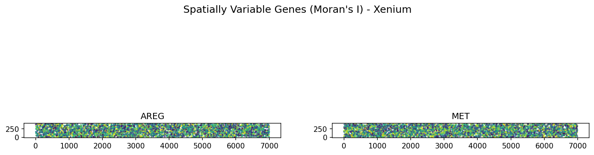
*Figure 18: The two genes with highest Moran's I spatial autocorrelation scores: **AREG** (amphiregulin, I=0.696, left) and **MET** (hepatocyte growth factor receptor, I=0.683, right). Both show sparse but spatially clustered expression patterns. **Biological significance:** **AREG** is an EGFR ligand frequently overexpressed in non-small cell lung cancer (NSCLC), promoting tumor cell proliferation and survival. **MET** is a known lung cancer oncogene and therapeutic target (crizotinib, cabozantinib). Their spatial clustering suggests focal tumor cell populations expressing cancer driver genes at specific anatomical locations within the tumor.*

### Moran's I Top 10 — Xenium Spatially Variable Genes

| Rank | Gene | Moran's I | FDR-adjusted p-value | Known Biology in Cancer |
|------|------|-----------|----------------------|------------------------|
| 1 | **AREG** | 0.696 | <0.001 | EGFR ligand, tumor growth, therapeutic resistance |
| 2 | **MET** | 0.683 | <0.001 | Oncogene, MET inhibitor target, metastasis driver |
| 3 | **ANXA1** | 0.667 | <0.001 | Annexin A1, inflammation, tumor invasion |
| 4 | **EPCAM** | 0.633 | <0.001 | Epithelial cell adhesion, cancer stem cell marker |
| 5 | **DMBT1** | 0.588 | <0.001 | Deleted in malignant brain tumors 1, immune modulation |
| 6 | **IGKC** | 0.549 | <0.001 | Immunoglobulin kappa constant, B cells / plasma cells |
| 7 | **IGHG1** | 0.518 | <0.001 | Immunoglobulin heavy chain, B cells / plasma cells |
| 8 | **IDO1** | 0.496 | <0.001 | Immune checkpoint, tryptophan metabolism, T-cell suppression |
| 9 | **SPARC** | 0.446 | <0.001 | Secreted protein acidic and rich in cysteine, ECM remodeling |
| 10 | **APOE** | 0.437 | <0.001 | Apolipoprotein E, lipid metabolism, tumor microenvironment |

**Clinical & Translational Relevance:** The top 10 includes known lung cancer drivers (**AREG**, **MET**), immune checkpoint molecules (**IDO1**), and markers of specific cell types (**IGKC/IGHG1** for B cells, **EPCAM** for epithelial cells). This demonstrates how spatial autocorrelation directly guides biological and translational discovery in cancer genomics.

### Key Takeaways

- **Single-cell resolution reveals fine-scale tumor architecture** — individual tumor cell nests, stromal barriers, and immune infiltrates are directly visible
- **Cluster 12's extreme self-enrichment (z > 100)** combined with short-range co-occurrence suggests a rare cell type forming tight, focal aggregates (e.g., tertiary lymphoid structures, tumor-associated macrophage clusters)
- **Delaunay triangulation is superior to kNN for Xenium** — respects local cell geometry without arbitrary k parameter
- **Control probe percentage must be <1%** — higher values indicate transcript misassignment artifacts
- **Moran's I top hits include clinically actionable genes** — **AREG** (EGFR pathway), **MET** (MET inhibitor target), **IDO1** (immune checkpoint) — demonstrating direct translational potential

---

## Cross-Platform Technology Comparison

### Resolution & Coverage Trade-Offs

| Platform | Resolution | Genes Profiled | Cells/Spots | Spatial Precision | Data Size | Cost per Sample |
|----------|------------|----------------|-------------|-------------------|-----------|----------------|
| **Visium** | ~55 µm spot (1-10 cells) | Whole transcriptome (~20k) | 3,000-5,000 spots | Spot-level | ~500 MB | $ |
| **Visium HD** | ~10 µm bins | Whole transcriptome | 10,000-50,000 bins | Sub-cellular approaching | ~2 GB | $$ |
| **Xenium** | Single cell | Targeted panel (313-5,000) | 50,000-1M cells | Single-cell | ~5 GB | $$$ |
| **CosMx SMI** | Single cell | Targeted panel (100-1,000) | 50,000-1M cells | Single-cell | ~5 GB | $$$ |
| **MERFISH** | Sub-cellular | Targeted panel (100-10,000) | 10,000-1M cells | Sub-cellular | ~10 GB | $$$$ |

### Computational Methods Covered in This Repository

| Method Category | Technique | Function | Applied In |
|-----------------|-----------|----------|-----------|
| **Quality Control** | Per-cell/spot metrics | Filter low-quality data | All notebooks |
| **Normalization** | Library-size normalization | Make samples comparable | All notebooks |
| **Feature Selection** | Highly variable genes (HVG) | Focus on biological signal | Notebooks 1, 4 |
| **Dimensionality Reduction** | PCA → UMAP | Visualize high-dim data | All notebooks |
| **Clustering** | Leiden community detection | Identify cell populations | All notebooks |
| **Spatial Visualization** | Overlay on tissue image | Map clusters to anatomy | All notebooks |
| **Image Analysis** | Watershed segmentation | Segment nuclei/cells | Notebook 2 |
| **Image Features** | Summary/texture/histogram | Quantify morphology | Notebooks 2, 3 |
| **Spatial Graphs** | kNN / Delaunay triangulation | Connect spatial neighbors | Notebooks 3, 4 |
| **Neighborhood Enrichment** | Permutation test | Test co-localization | Notebooks 3, 4 |
| **Co-occurrence** | Conditional probability | Proximity across scales | Notebooks 3, 4 |
| **Ligand-Receptor** | CellPhoneDB algorithm | Interaction screening | Notebook 3 |
| **Spatial Autocorrelation** | Moran's I statistic | Spatially variable genes | Notebooks 3, 4 |
| **Centrality** | Graph-theoretic measures | Network topology | Notebook 4 |

---

## Installation & Setup

### System Requirements
- **Operating System:** Linux (Ubuntu 20.04+), macOS, or WSL2 on Windows
- **RAM:** 16GB minimum, 32GB recommended (Xenium analysis)
- **Storage:** 10GB for repository + datasets
- **Python:** 3.9 or higher

### Quick Start

```bash
# Clone this repository
git clone https://github.com/YOUR_USERNAME/spatial-transcriptomics-10x-analysis.git
cd spatial-transcriptomics-10x-analysis

# Create a virtual environment
python3 -m venv spatial_env
source spatial_env/bin/activate  # On Windows: spatial_env\Scripts\activate

# Install dependencies
pip install --upgrade pip
pip install -r requirements.txt

# Launch Jupyter
jupyter notebook
```

### Dependency Versions

All packages listed in `requirements.txt`:

| Package | Version | Purpose |
|---------|---------|---------|
| scanpy | ≥1.9.0 | Core spatial transcriptomics toolkit |
| squidpy | ≥1.2.0 | Spatial graph & image analysis |
| anndata | ≥0.8.0 | Annotated data structure |
| spatialdata | ≥0.1.0 | SpatialData framework (Xenium) |
| spatialdata-io | ≥0.1.0 | Readers for spatial formats |
| numpy | ≥1.23.0 | Numerical computing |
| pandas | ≥1.5.0 | Data manipulation |
| matplotlib | ≥3.5.0 | Plotting |
| seaborn | ≥0.12.0 | Statistical visualization |
| scipy | ≥1.10.0 | Sparse matrices, statistics |
| scikit-image | ≥0.20.0 | Image processing |
| python-igraph | ≥0.10.0 | Graph analysis |
| leidenalg | ≥0.9.0 | Leiden clustering algorithm |

---

## Running the Analyses

### Execution Order (Recommended for Learning)

Run notebooks sequentially to build skills progressively:

```bash
# Activate environment
source spatial_env/bin/activate

# Navigate to notebooks
cd notebooks/01_visium_basics
jupyter notebook visium_lymph_node_analysis.ipynb

# Then proceed to:
# 02_visium_fluorescence/mouse_brain_fluorescence_imaging.ipynb
# 03_visium_hne/mouse_brain_spatial_statistics.ipynb
# 04_xenium/lung_cancer_single_cell_spatial.ipynb
```

Each notebook will:
- Download required datasets automatically (or provide instructions)
- Execute the complete analysis pipeline
- Save outputs to `results/figures/`
- Display figures inline

### Execution Time Estimates

| Notebook | Runtime | Bottleneck | Notes |
|----------|---------|-----------|-------|
| 01 Visium Basics | ~10 min | UMAP | Dataset auto-downloads |
| 02 Visium Fluorescence | ~15 min | Image segmentation | Pre-processed data included |
| 03 Visium H&E | ~20 min | Ligand-receptor screening | 1,000 permutations |
| 04 Xenium | ~45 min | Co-occurrence (161k cells) | Use 50% subsample |

**Hardware Note:** Xenium co-occurrence on full dataset (161k cells) requires 32GB RAM. Notebook uses 50% subsample by default.

---

## Key Findings Summary

### Biological Discoveries

1. **Lymph Node Architecture (Visium):**
   - Unsupervised clustering successfully identifies anatomical compartments (B-cell follicles, T-cell zones, germinal centers)
   - **CR2** expression perfectly co-localizes with follicular B-cell regions
   - Cluster 9 (lymphatic endothelium) is spatially restricted to capsule and sinuses

2. **Brain Morphology = Transcriptomics (Visium Fluorescence):**
   - Image-derived features (DAPI/NEUN/GFAP) independently recover gene-expression-based clusters
   - Hippocampal pyramidal layer detected by **nuclear density alone** (DAPI)
   - Validates multi-omics integration: morphology + transcriptomics measure same biology

3. **Spatial Organization Principles (Visium H&E):**
   - Hippocampus and Pyramidal\_layer show strong neighborhood enrichment (z-score >10)
   - **Olfm1** (I=0.763) is the most spatially variable gene — hippocampal CA field marker
   - **Plp1** (I=0.748) restricted to fiber tracts — myelin proteolipid protein

4. **Tumor Microenvironment Complexity (Xenium):**
   - Single-cell resolution reveals fine-scale spatial organization (161,000 cells)
   - Cluster 12 forms focal aggregates (z-score >100 self-enrichment) — rare specialized population
   - **AREG** (I=0.696) and **MET** (I=0.683) are top spatially variable genes — clinically actionable lung cancer drivers

### Technical Insights

- **Moran's I consistently identifies known region-specific markers** across both platforms
- **Neighborhood enrichment requires permutation testing** — observed co-occurrence alone is insufficient
- **Delaunay triangulation outperforms kNN for Xenium** — respects local cell geometry
- **Image features at two scales (1.0× and 2.0×) improve clustering** — captures spot-level + tissue-context
- **Control probe percentage <0.01% is essential for Xenium** — higher values indicate technical artifacts

---

## Limitations & Future Directions

### What This Analysis Doesn't Cover

1. **Trajectory inference** — Cell differentiation paths (requires developmental or disease progression data)
2. **Cell-cell interaction validation** — Ligand-receptor predictions need experimental validation (co-culture, perturbation)
3. **Spatial integration across samples** — Multi-sample alignment for batch effect correction and meta-analysis
4. **Subcellular resolution** — Visium captures spots (bulk), Xenium captures cells — neither resolves subcellular compartments
5. **Temporal dynamics** — All datasets are single time points; no longitudinal or time-series analysis

### Potential Extensions

- **Disease vs. healthy comparison** — Integrate lung cancer Xenium with normal lung tissue to identify tumor-specific spatial patterns
- **Deconvolution** — Computationally separate cell types within Visium spots using single-cell reference atlases (RCTD, Cell2location)
- **Spatial domain detection** — Use STAGATE or GraphST to identify tissue domains without pre-annotation
- **Receptor-ligand network visualization** — Build interaction graphs (CellChat, NicheNet) with edge weights from co-expression
- **Integrative multi-omics** — Combine spatial transcriptomics with spatial proteomics (CODEX, IMC) or spatial metabolomics (MALDI imaging)

---

## References & Acknowledgments

### Primary Literature

1. **Wolf, F. A., Angerer, P., & Theis, F. J. (2018).** SCANPY: large-scale single-cell gene expression data analysis. *Genome Biology*, 19(1), 15. [https://doi.org/10.1186/s13059-017-1382-0](https://doi.org/10.1186/s13059-017-1382-0)

2. **Palla, G., Spitzer, H., Klein, M., et al. (2022).** Squidpy: a scalable framework for spatial omics analysis. *Nature Methods*, 19, 171–178. [https://doi.org/10.1038/s41592-021-01358-2](https://doi.org/10.1038/s41592-021-01358-2)

3. **Virshup, I., Rybakov, S., Theis, F. J., Angerer, P., & Wolf, F. A. (2023).** The scverse project provides a computational ecosystem for single-cell omics data analysis. *Nature Biotechnology*. [https://doi.org/10.1038/s41587-023-01733-8](https://doi.org/10.1038/s41587-023-01733-8)

4. **Marconato, L., Palla, G., Yamauchi, K. A., et al. (2024).** SpatialData: an open and universal data framework for spatial omics. *Nature Methods*. [https://doi.org/10.1038/s41592-024-02212-x](https://doi.org/10.1038/s41592-024-02212-x)

5. **Ståhl, P. L., Salmén, F., Vickovic, S., et al. (2016).** Visualization and analysis of gene expression in tissue sections by spatial transcriptomics. *Science*, 353(6294), 78-82. [https://doi.org/10.1126/science.aaf2403](https://doi.org/10.1126/science.aaf2403)

6. **Efremova, M., Vento-Tormo, M., Teichmann, S. A., & Vento-Tormo, R. (2020).** CellPhoneDB: inferring cell-cell communication from combined expression of multi-subunit ligand-receptor complexes. *Nature Protocols*, 15, 1484–1506. [https://doi.org/10.1038/s41596-020-0292-x](https://doi.org/10.1038/s41596-020-0292-x)

7. **Türei, D., Korcsmáros, T., & Saez-Rodriguez, J. (2016).** OmniPath: guidelines and gateway for literature-curated signaling pathway resources. *Nature Methods*, 13, 966–967. [https://doi.org/10.1038/nmeth.4077](https://doi.org/10.1038/nmeth.4077)

### Educational Resources

- [**Scanpy Tutorials**](https://scanpy-tutorials.readthedocs.io/) — Official tutorials and best practices
- [**Squidpy Documentation**](https://squidpy.readthedocs.io/) — Spatial omics analysis guides
- [**scverse Ecosystem**](https://scverse.org/) — Single-cell and spatial analysis tools
- [**10x Genomics Learning Hub**](https://www.10xgenomics.com/support) — Platform-specific tutorials

### Datasets

- **10x Genomics Visium Datasets:** [https://www.10xgenomics.com/datasets](https://www.10xgenomics.com/datasets)
- **10x Genomics Xenium Datasets:** [https://www.10xgenomics.com/products/xenium-in-situ/dataset-explorer](https://www.10xgenomics.com/products/xenium-in-situ/dataset-explorer)
- **Squidpy Built-in Datasets:** Accessed via `sq.datasets.*` functions

---

## License

This project is licensed under the MIT License — you're free to use, modify, and distribute this code for educational or research purposes. See [LICENSE](LICENSE) for details.

If you use this repository in your work, please cite:

```
Asad, M. T. (2026). Spatial Transcriptomics Analysis: From Tissue Architecture to Molecular Networks.
GitHub repository: https://github.com/YOUR_USERNAME/spatial-transcriptomics-10x-analysis
```

---

## Contact

**Muhammad Taimoor Asad**  
BS Bioinformatics, SINES, NUST  
Registration Number: 473749  
Email: [your.email@example.com]  
LinkedIn: [Your LinkedIn Profile]  
GitHub: [@YOUR_USERNAME](https://github.com/YOUR_USERNAME)

*Questions about the analysis? Found an error? Want to collaborate? Open an issue or reach out directly!*

---

**Last Updated:** April 2026
